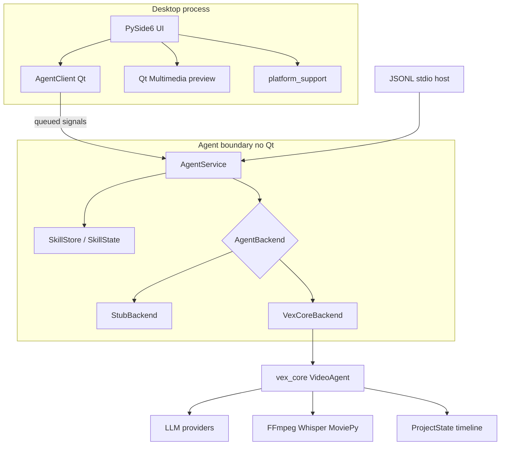

# Architecture

## High-level

The product is the **agent protocol**, not the window. The PySide6 app is one client. A CLI or a subprocess host can use the same `AgentService`.

## Boundary rules

- `vex_desktop.ui` may import `vex_desktop.agent.qt.AgentClient` and `vex_desktop.protocol` only.
- UI code must not import `vex_core`, `StubBackend`, `VexCoreBackend`, or `AgentService`.
- All agent ops (`load_project`, `process_command`, `undo`, `redo`, `set_config`, `export`, skills ops) run on a worker `QThread`.
- Preview plays `snapshot.working_file` or `exported_path`. Agent edits still go through FFmpeg/Vex off the UI thread. The TIMELINE filmstrip may run `platform_support.ffmpeg_path()` on a worker thread to grab stills; it must not import `vex_core` or `tools.*`.

## Protocol

Frozen JSON types in `vex_desktop/protocol.py` (`PROTOCOL_VERSION = 2`):

| Op | Payload | Result |
|----|---------|--------|
| `load_project` | `{video_path}` | snapshot + working file |
| `process_command` | `{command}` | summary, tools, snapshot |
| `undo` / `redo` | `{}` | snapshot |
| `snapshot` | `{}` | snapshot |
| `set_config` | `{provider, model}` | snapshot |
| `export` | `{preset, output_path?}` | `exported_path` + snapshot |
| `list_skills` | `{}` | `skills` catalog + snapshot |
| `import_skill` | `{path}` | `skills` catalog + snapshot |
| `remove_skill` | `{id}` | `skills` catalog + snapshot |
| `set_skills` | `{ids}` | `skills` catalog + snapshot |
| `cancel` | `{}` | flag only |

Progress events (`stage`, `message`, `tool`, `fraction`) stream while an op runs.

The same envelopes are used by `python -m vex_desktop.agent` (JSONL on stdin/stdout) so the service can later move to a subprocess without changing the UI.

## Skills

`vex_desktop.skills` is Qt-free: `SkillStore` (scan/import/remove under `data_dir()/skills`), `SkillState` (`data_dir()/skills.json` enabled set + seed flag), and `compose_preamble`.

Composition lives in `AgentService.handle("process_command")`: enabled skill bodies are prepended before dispatch to any backend. Injection is confined to `process_command`; export, undo, redo, and load do not see the preamble. The Skills dialog talks only to `AgentClient`.

## Backends

`VEX_AGENT_BACKEND=auto|stub|core` (default `auto`):

- **stub** — in-process stand-in; no FFmpeg, no LLM
- **core** — local Vex tree: `VEX_CORE_PATH`, else `~/claude_work/vex`, else `./vex_core`
- **auto** — core if that tree has `agent.py`, otherwise stub

Projects live in Vex’s `~/.video-agent/projects/`. `load_project` accepts a file path, a YouTube URL, or a project id.

Pin file: `vex_core.pin`. The checkout itself is gitignored.

## OS seam

`vex_desktop.platform_support` owns:

- `ffmpeg_path()`
- `data_dir()` / `projects_dir()`
- `get_secret` / `set_secret` (keyring, file fallback)
- `is_linux` / `is_macos`

No other module should branch on `sys.platform` without a strong reason.

## Threading

Long work (LLM, FFmpeg, Whisper) stays off the GUI thread. `AgentClient` emits `progress`, `result_ready`, and `failed`. The preview widget is swapped only after a successful result, on the GUI thread.
