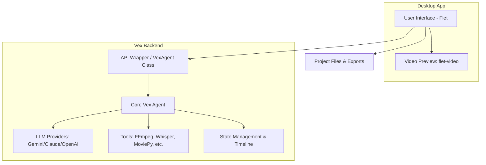

# Architecture Diagram

## High-Level Architecture

## Detailed Component Breakdown

- **Frontend (Flet)**: Chat interface, video player, timeline view
- **Backend Wrapper**: `VexAgent` class that exposes high-level methods
- **Original Vex**: Forked and integrated as a submodule or copied core modules

For a visual diagram, see the Mermaid code above (renders nicely in GitHub).